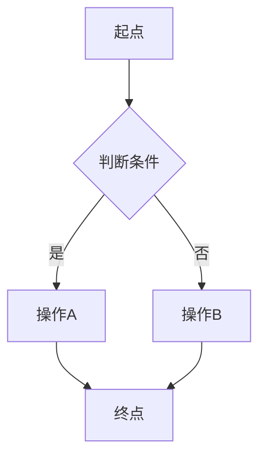
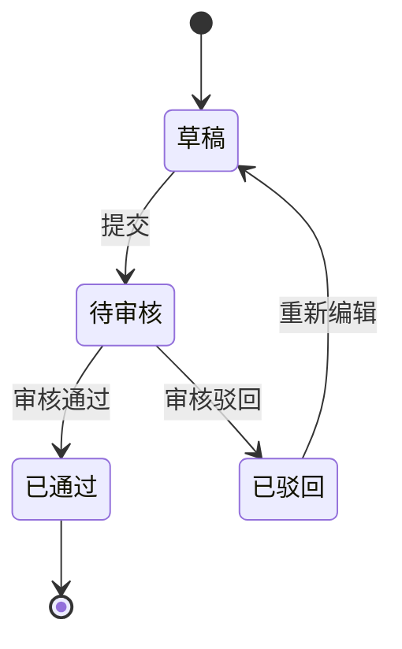

# PRD 完整模板

本文件是 `pm-prd-writer` skill 的参考模板。生成 PRD 时按此结构输出，每个章节的说明文字是写作指引（不要原样复制到最终文档里），根据实际需求填充内容。

> ⚠️ **本模板严格遵守"PRD 不含技术语言"原则**：
> - 页面身份用业务名称（不写路由）
> - 字段用业务名（不写英文/数据库字段名）
> - 接口用业务行为描述（不写 HTTP 方法/路径）
> - 性能用业务响应感受（不写 P99 / QPS）
> - 集成用业务系统名（不写协议/MQ topic）
>
> 技术细节统一移到独立的「技术方案文档」（本项目走 A3 tech-architect agent 产出）。

---

## 文档头部

```markdown
# [产品名称] 产品需求文档（PRD）

版本号：V1.0.0

| 版本   | 时间       | 修订人 | 备注             |
|--------|-----------|--------|-----------------|
| V1.0.0 | YYYY/MM/DD | xxx    | 创建 V1.0.0 版本 |
```

---

## 一、概述（为什么做）

### 1.1 产品概述及目标

#### 1.1.1 背景介绍
说明产品/功能诞生的背景：市场环境、用户痛点、业务诉求、竞品动态等。写清楚"为什么现在要做这件事"。

#### 1.1.2 产品概述
用 2-3 句话概括这个产品/功能是什么、做什么、给谁用。相当于电梯演讲。

#### 1.1.3 产品目标

**业务目标**
具体的、可量化的业务指标。

| 目标 | 指标 | 目标值 | 达成时间 |
|------|------|--------|---------|
| 例：提升转化率 | 注册→下单转化率 | 从 5% 提升至 8% | 上线后 3 个月 |

**用户目标**
从用户视角描述他们能获得什么。

| 目标用户 | 用户目标 | 衡量指标 |
|---------|---------|---------|
| 例：普通消费者 | 更快找到想要的商品 | 搜索到下单平均时长 < 3 分钟 |

#### 1.1.4 目标用户
列出所有会使用本系统的用户角色及其特征。

| 角色 | 描述 | 核心诉求 |
|------|------|---------|
| 例：管理员 | 负责系统配置和用户管理 | 快速完成批量操作 |

### 1.2 名词说明

| 名词 | 说明 |
|------|------|
| 例：车辆卡片 | 运营驾驶舱中代表单辆车的可折叠卡片组件 |

> ⚠️ 名词解释用业务语言。**禁止**写"`VehicleCard.tsx`" / "`battery_level` 字段" 这种技术表述。

### 1.3 角色及权限

| 角色 | 权限范围 | 数据范围 |
|------|---------|---------|
| 例：超级管理员 | 全部功能 | 全部数据 |
| 例：普通用户 | 查看、编辑自己的数据 | 仅本人数据 |

### 1.4 文档阅读对象

| 对象 | 关注内容 |
|------|---------|
| 研发 | 功能需求、业务规则、数据字典（**接口契约不在 PRD，看技术方案文档**） |
| UI/UX | 界面交互、全局规则、视觉颗粒度 |
| 测试 | 异常流程、验收标准 |
| 运营 | 产品目标、埋点方案 |

---

## 二、产品描述（做什么）

### 2.1 产品需求描述
对整体需求的概括性描述，概括做什么、不做什么、约束条件。

### 2.2 产品整体流程

#### 2.2.1 主流程
用 Mermaid flowchart 绘制。节点文字用**业务名称**。



#### 2.2.2 子流程
对主流程中复杂节点展开为子流程图。

#### 2.2.3 数据流图（业务视角）
图形化表示业务数据在系统间的流动。**业务视角描述**，不写数据库 / 队列 / 协议。
包含四个核心元素：
- 外部业务方（数据源/数据宿）
- 业务处理步骤
- 业务数据存档（如"操作日志归档"，不写表名）
- 业务数据流

#### 2.2.4 状态转换图（STD）
展示系统中关键业务对象（如订单、审批单、车辆）的状态流转。状态名用**业务名称**。



### 2.3 全局说明

#### 2.3.1 全局异常处理

| 异常场景 | 处理方式 | 提示文案 |
|---------|---------|---------|
| 网络异常 | 显示提示，支持重试 | "请检查网络连接" |
| 服务超时 | 显示提示，支持重试 | "系统响应超时，请稍后重试" |
| 权限异常 | 显示提示，不允许操作 | "无操作权限" |
| 系统异常 | 显示提示，记录日志 | "系统开小差啦，请联系管理员" |
| 数据异常 | 显示提示 | "数据异常或不存在" |

#### 2.3.2 普通列表规则

| 规则项 | 说明 |
|--------|------|
| 分页 | 默认 20 条/页，可调整为 10/50/100 |
| 排序 | 默认按创建时间倒序，支持点击表头排序 |
| 搜索 | 支持模糊搜索、多条件筛选 |
| 空数据 | 显示插画 + "暂无数据" |
| 统计 | 列表顶部展示统计信息 |
| 导出 | 支持 Excel 导出 |
| 批量操作 | 需二次确认 |

#### 2.3.3 全局交互

| 场景 | 交互方式 |
|------|---------|
| 操作成功 | Toast 提示"操作成功"，自动消失 |
| 操作失败 | 弹窗提示错误详情 |
| 加载中 | 显示全局 loading 动画 |
| 表单保存 | 自动返回上一页并提示 |
| 删除操作 | 二次确认弹窗 |
| 异步操作 | 按钮置灰防止重复提交 |
| 空状态 | 显示插画 + 文字提示 |

### 2.4 产品版本规划（里程碑）

| 版本 | 范围 | 计划时间 | 状态 |
|------|------|---------|------|
| V1.0 | 核心功能（MVP） | YYYY/MM | 进行中 |
| V1.1 | 增强功能 | YYYY/MM | 规划中 |
| V2.0 | 全量功能 | YYYY/MM | 远期 |

### 2.5 产品框架
描述产品的整体结构、业务模块划分、模块间业务关系。可使用架构图。**写业务架构**（哪些业务模块、它们做什么），不写技术架构（前后端栈、部署拓扑）。

### 2.6 功能清单

| 模块 | 功能 | 优先级 | 版本 | 说明 |
|------|------|--------|------|------|
| 用户管理 | 注册登录 | P0 | V1.0 | 支持手机号+验证码 |
| 用户管理 | 个人信息 | P1 | V1.0 | 头像、昵称、手机号 |

---

## 三、功能需求（怎么做）

每个功能模块按以下结构书写。如有子功能，递归使用同样的结构。

### 3.x [功能模块名]

#### 3.x.1 描述
一句话描述这个功能做什么。

#### 3.x.2 用户故事
```
作为 [角色]，我希望 [操作]，以便 [目的]。
```
可以有多条用户故事。

#### 3.x.3 前置条件
使用该功能需要满足的前提条件。

| 类型 | 条件 |
|------|------|
| 数据依赖 | 例：用户已完成实名认证 |
| 权限依赖 | 例：需要管理员角色 |
| 功能依赖 | 例：需先完成 3.1 用户注册 |

#### 3.x.4 后置条件
执行该功能后，系统状态发生的变化。
- 例：列表数据更新
- 例：触发通知给相关人员

#### 3.x.5 界面及交互（**核心**）

**a. 页面身份与入口**（**业务语言**）

| 项 | 内容 |
|---|---|
| 页面名称 | 例：运营驾驶舱 - 车辆列表 |
| 所在端 | 例：管理后台 / 司机端 / 大屏 / H5 |
| 入口路径 | 例：登录后 → 顶部导航「运营」→ 左侧「车辆管理」→「车辆列表」 |

> 🚫 **不要**写 `/admin/dashboard/vehicle` 这种路由。

**b. 改动颗粒度表（🆕 必填，UI 改动专用）**

> 这张表是本项目历史事故的直接产物——列表/卡片类需求若不在这里说清楚"是每项都加还是只有部分加"，研发拿到 PRD 一定会理解错。

| 改动项 | 作用粒度 | 位置 | 可见性条件 | 触发后行为 |
|---|---|---|---|---|
| 例：「展开详情」按钮 | 车辆卡片**每一张** | 卡片右上角 | 所有角色可见 | 点击后卡片高度展开，显示更多字段 |
| 例：「批量导出」按钮 | 列表**整体**（页面级） | 列表顶部工具栏右侧 | 仅运营管理员可见 | 弹出导出范围选择弹窗 |
| 例：「禁用」标记 | 仅状态 = 维修中的卡片 | 卡片左上角角标 | 所有角色可见 | 无（仅展示） |

**c. 控件视觉规范表**（🆕 必填）

> 视觉细节如需 px 级，本项目走 A1.5 visual-spec-author 产出；本表只写业务可判断的样式描述。

| 元素 | 类型 | 必填 | 默认值 | 5 态表现 | 校验规则 / 限制 |
|------|------|------|--------|---------|----|
| 例：「展开详情」按钮 | 主按钮（中号） | - | 文案"展开详情" | 默认：主色填充<br>悬停：主色加深 10%<br>禁用：灰色，鼠标禁用样式<br>加载：按钮内置 loading + 文案"加载中"<br>成功：卡片展开后按钮文案变"收起详情" | - |
| 例：名称输入框 | 文本输入 | 是 | - | 默认 / 聚焦 / 错误 / 禁用 / 成功 | 1-50 字符，不含特殊字符；超长提示"最多 50 字" |

#### 3.x.6 业务流程
用 Mermaid 绘制该功能的业务流程。节点用业务名。

#### 3.x.7 异常/分支流程

| 场景 | 触发条件 | 处理方式 | 提示文案 |
|------|---------|---------|---------|
| 重复提交 | 用户连续点击提交 | 首次点击后按钮置灰 | - |
| 数据不存在 | 查询无对应数据 | 返回空状态页 | "内容不存在或已删除" |

#### 3.x.8 数据字典（**业务字段名**）

> 🚫 **不要**写 `battery_level` / `vehicleId` / `created_at`。这些是技术方案的事。
> ✅ 用业务名 + 业务类型，让产品 / 运营 / 测试都看得懂。

| 业务字段名 | 业务类型 | 必填 | 业务说明 | 示例值 |
|--------|------|------|------|--------|
| 车辆编号 | 编号（系统生成） | 是 | 唯一标识一辆车 | V001 |
| 车辆名称 | 文本（≤ 50 字） | 是 | 运营对外可见的车辆显示名 | "1 号班车" |
| 当前状态 | 枚举（草稿/运营中/维修中/已停用） | 是 | 车辆生命周期状态 | 运营中 |
| 入网时间 | 日期时间 | 是 | 车辆首次纳入运营的时间 | 2025-01-01 12:00:00 |

#### 3.x.9 子功能
如有子功能，递归使用 3.x.1 - 3.x.8 的结构。

---

## 四、非功能需求（业务约束，非实现细节）

### 4.1 安全与合规需求

| 需求 | 说明 |
|------|------|
| 敏感信息保护 | 用户手机号 / 身份证号需脱敏展示（如 138****1234） |
| 数据加密 | 用户密码、支付凭证等敏感数据需加密保存（实现细节见技术方案） |
| 权限控制 | 不同角色只能操作授权范围内的数据 |
| 合规要求 | 符合《个人信息保护法》等相关法规 |

### 4.2 统计需求（埋点）

> 事件名用业务术语（中文 / 一致的 snake_case 业务 key），不写数据库字段名风格。

| 事件名 | 触发时机 | 业务属性 | 业务用途 |
|--------|---------|------|------|
| 页面浏览 | 用户进入某业务页面 | 页面业务名、用户角色 | 页面访问统计 |
| 关键操作 | 点击核心业务按钮（如下单、确认） | 操作名、所在页面 | 操作转化分析 |
| 表单提交 | 表单提交成功 | 表单业务名、耗时 | 表单完成率统计 |
| 业务异常 | 业务流程被中断 | 异常类型、所在步骤 | 业务监控 |

### 4.3 性能业务期望（不写技术指标）

| 业务感受 | 期望 |
|------|------|
| 页面打开速度 | 用户感觉"立即可用"——常规网络下不超过 2 秒看到主要内容 |
| 操作反馈 | 用户点击按钮后 0.5 秒内有视觉反馈（loading / 状态变化） |
| 数据刷新 | 状态变化需在 5 秒内反映给驾驶员 / 调度员 |
| 可用性 | 业务高峰期不中断，日常使用不感知系统故障 |

> 具体技术指标（QPS / P99 / 并发量）由 A3 tech-architect 在技术方案文档中给出。

### 4.4 数据生命周期（业务侧）

| 数据类型 | 业务保留期 | 谁能看 | 备注 |
|---|---|---|---|
| 操作日志 | 6 个月 | 管理员 | 用于业务追溯 |
| 用户行为埋点 | 12 个月 | 运营 | 用于业务分析 |
| 已删除数据 | 软删除保留 30 天 | 仅超管 | 误删可恢复 |

> 表结构 / 归档技术方案 → 技术方案文档。

### 4.5 业务系统集成

| 对接系统 | 协作方向 | 业务用途 |
|---------|---------|------|
| 例：用户中心 | 读取 | 获取用户基础信息 |
| 例：消息中心 | 通知 | 关键状态变化时推送消息 |
| 例：工单系统 | 读写 | 车辆故障时自动建工单 |

> 接口契约 / 协议 / 同步方式 → 技术方案文档。

---

## 五、附录（补充文档）

### 5.1 验收标准与测试要点

| 功能 | 验收条件 | 优先级 |
|------|---------|--------|
| 例：用户注册 | 输入合法手机号+验证码，注册成功后跳转首页 | P0 |
| 例：用户注册 | 输入已注册手机号，提示"该手机号已注册" | P0 |
| 例：用户注册 | 验证码过期后提交，提示"验证码已过期" | P1 |
| 例：车辆卡片展开 | 每张卡片右上角都有「展开详情」按钮，点击后卡片高度展开 | P0 |
| 例：车辆卡片展开 | 已展开的卡片再次点击按钮，卡片收起 | P0 |
| 例：车辆卡片展开 | 加载超时（> 5s）显示重试提示 | P1 |

### 5.2 关联文档（技术细节请查阅这些）

| 类型 | 文档 |
|---|---|
| 技术方案 | <技术方案文档路径，本项目 = .draft 包内 04-接口契约.md + 01-需求范围与边界.md> |
| 视觉规范 | <如有，A1.5 产出的 01.5-视觉规范.md + attachments/demo/> |
| 接口契约 | <见技术方案文档> |
| 数据库设计 | <见技术方案文档> |
