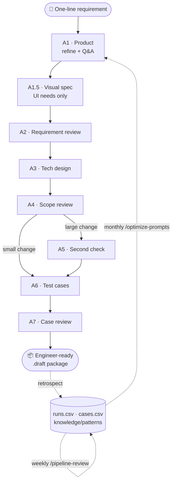

# claude-product-pipeline

> **Turn a one-line product requirement into an engineer-ready delivery package — via an 8-agent [Claude Code](https://docs.claude.com/en/docs/claude-code) pipeline. Self-evolving, project-agnostic.**
> 把一句话需求孵化成研发可直接施工的交付包 —— 8 个 Claude Code agent 的流水线引擎。越用越聪明，项目无关。


**English** · [中文](#中文)

---

## What is this

A pipeline that turns *"I want feature X"* into a spec a developer (human or AI like Codex) can build from **without further clarification** — by routing it through **8 specialized Claude Code sub-agents + 5–6 human gates**, then sedimenting every run so the pipeline **gets smarter the more you use it**.

It ships as a **project-agnostic skeleton**: clone it, run `/init-project`, and it reads your codebase to build *your* project's rules. All project-specific knowledge lives in a single file — `PROJECT-PROFILE.md`.

## How it works



- **8 agents**: A1 Product → A1.5 Visual spec *(UI only)* → A2 Requirement review → A3 Tech design → A4 Scope review → A5 Second check *(only if A4 flags a large change)* → A6 Test cases → A7 Case review
- **2 meta-agents**: `pipeline-retrospector` (sediments each delivery) + `pipeline-evaluator` (weekly report)
- **Output**: a `deliverables/*.draft` package = the blueprint a developer/Codex builds from directly
- **Self-evolving loop**: every `.done` package writes to `runs.csv` / `cases.csv`; `/pipeline-review` produces a weekly report; `/optimize-prompts` folds recurring lessons back into the agent prompts
- **Design quality built in**: 34 methodology cards + head-of-pipeline quality loops (A1 self-walkthrough / A2 usability soft-gate / A1.5 4-lens self-critique) + auto style adaptation (extract real style, or pick once from mini-demos)
- **Deterministic guardrails** (patch-014): gated scripts (ID dispenser / state-machine promote) + git pre-push whitelist gate + Claude Code hooks + a **self-tested skeleton** (lint-skeleton + selftest run in CI) — rules that used to rely on prompt obedience are now mechanically enforced (see *Built-in: deterministic guardrails*)
- **Delivery-package final check**: before handoff, a ~1s read-only script reconciles the 11 docs *against each other* (interface↔contract, test-case↔snapshot, visual-gate↔package-type, change-id consistency) — catching integration-level drift no single-document review can (see *Built-in: delivery-package final check*)
- **Dual-axis adaptation** (v1.1): two *orthogonal* per-project profiles — `platform` (web / native-iOS / Android / Flutter / RN…) and `audience` (toB / toC / both) — let agents gate demo mode, acceptance driver and "what's a dealbreaker" without collapsing into one enum

## Quick start

```bash
git clone https://github.com/ayouaiyouwei-arch/claude_pm_workflows.git my-project-pm
cd my-project-pm
# Open in Claude Code — CLAUDE.md auto-detects a fresh skeleton and lists what to provide
/init-project          # pulls your code, drafts rules, confirms with you, fills PROJECT-PROFILE.md
/init-docs             # (legacy systems) reverse-engineer as-is docs: 6 files per module + test-case library, batchable
/new-feature "<your one-line requirement>"
```

### Built-in: design methodology cards

The skeleton ships with **34 design-methodology cards built in** at `knowledge/methodology/` (snapshot): `heuristic-evaluation` (Nielsen 10 + severity scale), `critique-visual-hierarchy` / `critique-composition` / `critique-typography`, `user-flow-diagram`, `error-handling-ux`, `ux-writing`, `form-design`, `data-visualization`, `ui-ux-pro-max` (99 UX guidelines), and more — see `knowledge/methodology/README.md` for the full list. A1 / A1.5 / A2 read them on demand to ground flow design, edge-state design, demo self-critique and the A2 usability scan in industry best practice. **No extra installation needed.** Resolution order: project `knowledge/methodology/<name>.md` → fallback user-level `~/.claude/skills/<name>/SKILL.md` → skip without blocking. Project facts always win over methodology.

### Built-in quality loops

The head of the pipeline now iterates **before** anything reaches your gate (mirroring the proven `/iterate-A7` tail loop):

- **A1 self-walkthrough** — after drafting a spec, A1 re-walks it as a new user *and* a power user against Nielsen's 10 usability heuristics, fixes what it safely can, and leaves a residual table for A2
- **A2 usability soft-gate** — an 11th review check scores usability findings 0–4; severity ≥ 3 findings are **surfaced to you verbatim** (three dispositions: rework / intentional / pass down) — never auto-rejected, never silently swallowed
- **A1.5 4-lens self-critique** — every demo screenshot passes visual-hierarchy / composition / typography / polish review (≤ 2 rounds, majors must be fixed or escalated) before you see it; revision rounds ship with before/after comparison shots
- **`/iterate-A2`** — review rejections auto-loop on form-level issues (A1 fix → A2 re-review, ≤ 2 rounds) while product decisions always escalate to you

Five loop principles baked in: hard round caps · explicit convergence criteria · external judging standards with audit trails · stop-on-new-issue · **loops never replace human gates**.

**And the loops are measured** (patch-012): every loop leaves a machine-readable `loop-trace` block that lands in `evals/loops.csv` (rounds, caught/self-fixed/escalated, cap-hits, broke-something stops), every post-ship defect lands in `evals/escapes.csv` (found-at vs should-have-been-caught-at layer), and the weekly report renders an interception funnel + loop convergence dashboard — so "did the loops actually move defect detection earlier" is a number, not a feeling. All three eval CSVs are schema-validated at write time (`scripts/validate-evals-csv.sh`).

### Built-in: closure-driven test generation

Test cases are generated **closure-first, not additively** — the fix for "the cases are never complete" (on both new features and new-project onboarding):

- **Coverage-obligation denominator** — before writing a single case, the generator enumerates every obligation from the module docs (each functional point in `01`, every rule / legal+illegal state transition / decision-table row / permission cell in `04`, every high-severity issue in `03`, every linked diff/change-request, every acceptance point), maps each to ≥1 case, and **lists what's uncovered**. Additive "apply the 6 methods, hit the quotas" generation silently drops the long tail.
- **Cross-module chains have an owner** — most defects live at module seams (upstream-write → downstream-read), invisible to per-module cases; a dedicated `SCN` stage generates end-to-end chains from the product-map main flows.
- **Dual gates** — **G1 static** (`test/tools/lint-cases.js`: frozen header / 19-col field count / id uniqueness / method tag / ratio / ref traceability — cheap, wire to CI/pre-commit) + **G2 read-code adversarial review** (a skeptic reads the actual code snapshot to catch assertions that don't match reality — ~11% of auto-generated cases on the origin project).
- **Named dynamic workflows** — `gen-cases` (closure-driven generation + built-in G2), `gen-cases-spec` (same engine for target-state/spec-doc cases, e.g. `/new-feature` A6) and `coverage-audit` (per-module traceability matrix + adversarial gap check) live in `.claude/workflows/`, called hybrid-style by `/init-docs` and `publish-baseline` (the command keeps your gates; the workflow only fans out).

### Auto style adaptation

A1.5 designs in **your project's actual visual style**, not generic best-practice taste:

- **Existing UI** → `/init-project` (or the `extract-visual-baseline` skill anytime) scans your frontend code — real color histogram, type scale, spacing rhythm, radius/shadow habits, component usage, UI deps — into a visual baseline that **hard-constrains every demo** (off-palette colors get rejected at review)
- **No UI yet** → A1.5 proposes 2–3 style candidates as mini-demo screenshots; you pick once (Gate 1.5-style), the choice is frozen as the baseline, and every later feature follows it automatically
- **Baseline drift** → re-run the scanner anytime; a drift report asks you per finding: *update the baseline* or *log a deviation for dev to converge*

### Built-in: deterministic guardrails

Prompts are *probably* obeyed; hooks and gated scripts are *always* executed. The skeleton ships a layered defense stack — battle-tested on the origin project, where every prose-only rule eventually failed (11 packages missed retrospect, 5 ID collisions):

- **Gated scripts (L1, structural elimination)** — `next-id.sh` single ID dispenser (5-source scan + `--check`), `promote.sh` state machine with 3 gates (single-active / **ledger-before-done** / archive-only-done), `git-biz-push.sh` with 5 self-checks built in, `load-secrets.sh` (secrets live outside the repo)
- **Git pre-push hard gate (L2)** — push-branch **whitelist** (blacklist mode that "only blocks release" provably leaks `main`/tag pushes), mirror-path whitelist, delivery-prompt presence check — and it catches **every** push agent on the machine (Claude, Codex, humans), which Claude Code hooks alone cannot
- **Claude Code hooks (L4)** — `guard-bash` blocks bypassing the gated scripts (exit 2 feeds a fix-it-now message back to the model), `post-csv-validate` schema-checks eval ledgers right after every write, `session-start-brief` injects a ≤15-line state brief (in-flight packages, pipeline progress, name-level ledger reconciliation) at session start — all wired in `.claude/settings.json` via `$CLAUDE_PROJECT_DIR`, zero per-machine config
- **Resumable pipelines** — each `/new-feature` run keeps a `pipeline-state.json` (current step, gate status) inside its package dir: parallel pipelines stay isolated, and context compaction can't lose your place
- **Self-tested skeleton (CI)** — `lint-skeleton.sh` (reference integrity: agent / command / pattern / workflow cross-links resolve) + `selftest.sh` (drives the whole deterministic layer — gated scripts, hooks, state-machine contract, schema validators, final-check — in a synthetic sandbox with zero residue) run on every push via GitHub Actions. A rename or a regex regression fails CI, not silently at runtime — the fix for "this skeleton has never run end-to-end."

Every script has a ⚙️ parameter block; `/init-project` fills it from `PROJECT-PROFILE.md` § 2 (defaults = the common two-way branch-isolation convention, so same-convention projects run unchanged).

### Built-in: delivery-package final check (cross-product consistency)

The per-stage reviews (A2 / A4 / A7) each vet **one** document; packaging only counts files. Nothing checked whether the **11 docs fit together** — so integration-level drift (an interface with no contract, a test-case that exists nowhere, a visual gate left in a non-UI package, a change-id mismatch) leaked through to dev or PM gray-env (exactly the `evals/escapes.csv` "passed-everything-still-escaped" class). `scripts/deliverable-final-check.sh` closes that seam: a ~1-second, read-only cross-reference audit, run at packaging (`/new-feature` step 8.6b) and again before `.active`.

- **6 check groups** — mechanical completeness · scaffold-placeholder residue (reported with file:line) · interface list ⟺ detail contract (+ dead-reference scan in 05/06) · test-case ⟺ snapshot/registry reconciliation (+ must-pass-vs-deprecated contradiction) · visual-gate ⟺ package-type ⟺ demo · change-id consistent across dir-name / 01 / 99
- **Evidence-driven, not subjective** (per P007) — objective reconciliations only, no quality "score"; complements (does not duplicate) A2/A4/A7 and the weekly evaluator. `exit 1` BLOCKER = not ready for handoff; WARN = PM judges.
- **Hardened** — positive + negative + fault-injection fixtures live in `selftest.sh § G` (CI-gated); an adversarial multi-agent review found and fixed five false-positive classes before ship. Deeper semantic checks (enum / module-name / metadata) are documented as v2 candidates in `deliverables/_交付包终审清单.md`.

## Design principle: generic engine, project-specific knowledge

| Layer | What | Portability |
|---|---|---|
| 🟢 **Engine** (process / reviews / evolution) | 8 agents + commands + evals/optimization/knowledge mechanics | **works as-is** |
| 🟡 **Knowledge** (project-specific) | core-architecture blacklist / domain terms / tech stack / git & acceptance conventions | **filled by `/init-project` into `PROJECT-PROFILE.md`** |
| 🔴 **Data** | each project's change logs / packages / learned patterns | **grows from empty** |

The key move: **all project-specific knowledge collapses into one file (`PROJECT-PROFILE.md`)** that every agent references — so porting to a new project = refilling one file.

## What's inside

```
PROJECT-PROFILE.md       # single source of project config
CLAUDE.md                # session preamble + first-run onboarding trigger
.claude/
├── agents/   (11)       # 8 pipeline agents + 2 meta agents + legacy-excavator (reverse-PRD digger)
├── skills/   (23)       # packaging / promotion / testing / acceptance-regression / extract-visual-baseline / knowledge / baseline
├── commands/ (9)        # /init-project /init-docs /new-feature /pipeline-review /optimize-prompts /babysit-active /iterate-A7 /iterate-A2 /dev-verify
└── workflows/(3)        # named dynamic workflows: gen-cases (closure-driven test gen + G2) / gen-cases-spec (target-state/spec-doc cases) / coverage-audit
product-docs/baseline/   # version / diff / change ledgers (empty, grow as you go)
product-docs/modules/    # as-is docs, 6 files per module (built by /init-docs · long-lived fact source)
deliverables/_template/  # delivery-package template (12 root docs + snapshot + demo)
deliverables/_交付包终审清单.md # delivery-package final-check checklist (human-readable companion)
test/tools/e2e-scripts/  # independent acceptance e2e skeleton (L0–L5 + role matrix + config template)
test/tools/lint-cases.js # G1 static gate for the test-case library (header / field count / traceability)
knowledge/methodology/   # 34 design-methodology cards (built-in snapshot · zero install)
knowledge/patterns/      # built-in generic methodologies + your project's learned ones
scripts/                 # gated scripts (next-id / promote / git-sync / git-biz-push / load-secrets)
│                        #   + validators: lint-skeleton / selftest / validate-evals-csv / validate-pipeline-state / deliverable-final-check
├── hooks/               # Claude Code hooks ×3 (guard-bash / post-csv-validate / session-start-brief)
└── git-hooks/           # pre-push hard gate (branch whitelist + mirror whitelist + prompt presence)
.github/workflows/       # skeleton-ci.yml — lint-skeleton + selftest on every push (self-tested skeleton)
evals/ · optimization/   # runs.csv + weekly reports · prompt patches + agent versions
```

## Built-in methodologies (ship with the skeleton)

Seven cross-project "battle rules" distilled from real projects:

- **P001 — UI granularity**: specs must state each interaction's granularity / position / 5 states / visibility
- **P002 — no tech-speak in PRDs**: requirements use business language, not routes / endpoints / file paths
- **P003 — no AI over-reach**: when ambiguous, ask — don't invent
- **P004 — no retrospect lag**: every `.done` must write `runs.csv` (3-layer guard built in)
- **P005 — dev-gray smoke verify**: after every `.done`, PM independently clicks through dev gray (`/dev-verify` · 3-layer guard built in)
- **P006 — A4 → A5 → G-gate → DRIFT 4-tier intercept**: technical commitments get challenged at A5, gated at G-checks, drift-logged on mismatch — zero rework on contract-fact misalignment
- **P007 — evidence-driven conventions**: grep real code before asserting any code convention, or mark it a guess

Everything else (domain-term confusion, acceptance env, branch isolation…) **your project grows on its own** after a few runs.

## Independent acceptance regression (built-in)

A **second track, separate from dev self-tests**: real-environment, black-box, PM-owned acceptance. Reusing the dev team's (often mocked) runner means your acceptance adds no independent signal — so the skeleton ships its own.

- **3 principles**: real env (no mock) · black-box behavior (no source/SQL peeking) · independent assertions (acceptance cases, not dev contracts) → never drifts from implementation
- **L0–L5 layers**: login smoke / module regression / role permission matrix / cross-module scenario / visual regression / one-command orchestration
- **Generic report engine** at `~/.claude/skills/acceptance-regression/`: aggregates Playwright `results.json` → a Markdown acceptance report (by layer / module / priority + role matrix + P0 red-line gate). Project values injected via `acceptance.config.json`.
- **New project**: drop an `acceptance.config.json` + write black-box specs → `pnpm acceptance:full` → an independent acceptance report. Engine reused, zero rewrite.

## The self-evolving loop

Every delivery feeds back into the engine — so it sharpens *per project*:

- **Sediment** — each `.done` package auto-writes `runs.csv` + `cases.csv`; a recurring lesson lands a `knowledge/patterns/` entry (via the `pipeline-retrospector` meta-agent).
- **Review** — `/pipeline-review` runs weekly: the `pipeline-evaluator` emits a report (pass rate, recurring misses, rubric sampling).
- **Optimize** — `/optimize-prompts` runs monthly: lessons raised ≥ N times **fold back into the agent prompts** (agent version bumped + changelogged), so the *next* feature is reviewed by smarter agents.
- **Highest-signal inputs** — not just test failures, but **independent-acceptance findings** (real-env black-box) and **PM gray-env hands-on** — exactly the signals a mocked dev runner misses.

Net effect: the engine ports as-is; the smarts regrow per project — recurring mistakes get caught earlier, estimates sharpen, and the agents themselves improve, automatically.

---
---

<a name="中文"></a>
# 中文

> 一套"用 AI agent 团队把一句话需求孵化成研发可直接施工的交付包"的流水线引擎。
> 本仓库是**项目无关骨架**——克隆下来接任何项目即可用，项目专属知识由 `/init-project` 向导梳理后写入 `PROJECT-PROFILE.md`。

## 这是什么

把"产品需求 → 研发交付"的过程拆成 **8 个 AI agent + 5~6 个人工 Gate** 的流水线，并自带"越用越聪明"的自我进化闭环（评估 → 优化 → 知识沉淀）。

- **8 agent**：A1 产品 / A1.5 视觉规范（仅 UI 类）/ A2 需求审 / A3 技术 / A4 范围审 / A5 二次校验（仅 A4 触发）/ A6 用例 / A7 用例审
- **自进化**：每次交付后 `pipeline-retrospector` 自动沉淀；`/pipeline-review` 周报；`/optimize-prompts` 月度把踩坑提炼进 agent prompt
- **设计力**：34 张设计方法论卡片内置 + 头部质量循环（A1 自走查 / A2 可用性软闸 / A1.5 四视角自评）+ 风格自动适配（提取真实风格 or 看图选型一次固化）
- **可度量**（patch-012）：每个质量循环留机器可读 loop-trace → `evals/loops.csv`（轮数/检出/自修/超限/改坏）；交付后逃逸缺陷登 `evals/escapes.csv`（发现层 vs 应拦截层）；周报出拦截漏斗 + Loop 收敛仪表——"循环有没有用"从感觉变成数字；三张评估 CSV 写入时 schema 校验
- **确定性防护**（patch-014）：收口脚本（发号器 / 状态机 promote）+ git pre-push 白名单硬闸 + CC hooks 三件套 + **骨架自检 CI**（lint-skeleton + selftest 每次 push 跑）——曾经靠提示词自觉的规则现在机器强制执行（详见下方"内置：确定性防护"）
- **交付包终审**：打包前用一个约 1 秒的只读脚本把 11 个文档**互相勾稽**（接口↔契约、用例↔snapshot、视觉门槛↔包类型、编号一致）——拦住单看每份都对、拼一起对不上的集成级漂移（详见下方"内置：交付包终审"）
- **双轴适配**（v1.1）：每个项目声明两条**正交**档案——`platform`（web / 原生 iOS / Android / Flutter / RN…）与 `audience`（toB / toC / both）——agent 据此对 demo 载体、验收驱动、"什么算劝退"分别门控，不合并成单枚举
- **产物**：`deliverables/*.draft` 包 = 给研发/Codex 拿到就能干活的施工图

## 设计原则：引擎通用，知识专属

| 层 | 内容 | 移植性 |
|---|---|---|
| 🟢 引擎（流程/审核/进化机制）| 8 agent + 命令 + evals/optimization/knowledge 机制 | **直接通用** |
| 🟡 知识（项目专属）| 核心架构黑名单 / 领域术语 / 技术栈 / git 约定 / 验收环境 | **由 `/init-project` 梳理后填入 `PROJECT-PROFILE.md`** |
| 🔴 数据 | 各项目的变更台账 / 交付包 / 实战 patterns | **随用随长，从空开始** |

关键设计：**所有项目专属知识收敛到唯一一个文件 `PROJECT-PROFILE.md`**，所有 agent/skill 引用它，不在各自文件里硬编码。换项目 = 重填这一个文件。

## 怎么用（新项目接入 3 步）

```bash
# 1. 克隆
git clone https://github.com/ayouaiyouwei-arch/claude_pm_workflows.git my-project-pm && cd my-project-pm
# 2. 在 Claude Code 里开第一段对话 —— CLAUDE.md 会自动检测到空白骨架并列出前置准备清单
# 3. 运行接入向导
/init-project        # 拉你的代码 → 主动梳理规则 → 逐项问你确认 → 填 PROJECT-PROFILE.md
/init-docs           # （存量系统）反向沉淀现状文档：每模块 6 件套 + 用例库底座，可分批续跑
/new-feature "<你的一句话需求>"
```

`/init-project` 会：① 先告知你要准备哪些信息（git 等）② 拉代码到 `code/` ③ **主动 grep/读代码**梳理【核心架构黑名单】【领域术语表】【技术栈/端结构】候选（带出处，遵守"实证驱动"）④ **写入前逐项问你确认**（绝不自作主张写 LOCKED）⑤ 确认后落 `PROJECT-PROFILE.md` + 初始化 agent 版本 + baseline 空台账。

### 内置：设计方法论卡片

骨架**自带 34 张设计方法论卡片**（`knowledge/methodology/` 快照）：`heuristic-evaluation`（Nielsen 10 条 + 严重度量表）、`critique-visual-hierarchy` / `critique-composition` / `critique-typography`、`user-flow-diagram`、`error-handling-ux`、`ux-writing`、`form-design`、`data-visualization`、`ui-ux-pro-max`（99 条 UX 红线）等——完整清单见 `knowledge/methodology/README.md`。A1 / A1.5 / A2 按需读取，为流程设计、边界态设计、demo 自评与 A2 可用性快扫提供行业最佳实践依据。**克隆即用，无需额外安装。**读取顺序：项目内 `knowledge/methodology/<name>.md` → 兜底用户级 `~/.claude/skills/<name>/SKILL.md` → 都缺失跳过不阻塞。方法论与项目事实源冲突时，永远以项目文件为准。

### 内置：质量自迭代循环

流水线头部现在**先自己转一轮再来找你**（复制尾部 `/iterate-A7` 已验证的闭环模式）：

- **A1 自走查** —— 写完需求细化先戴"新用户 / 熟练用户"两顶帽子按 Nielsen 10 条可用性法则走查一遍，能修的自己修，修不了的留残留表给 A2 复扫
- **A2 可用性软闸** —— 新增第 11 项审核：可用性问题打 0~4 分；3 分以上**原样亮给你**两选处置（回炉 / 说"我故意的"则带备注放行）——绝不自动打回、绝不悄悄吞掉
- **A1.5 四视角自评** —— 每张 demo 截图先过"视觉层级 / 构图留白 / 排版 / 打磨细节"四维评审（最多 2 轮 · 重大问题修完才许给你看）；你说"改 X"后下一轮必附改前/改后对比图
- **`/iterate-A2`** —— 审核打回自动闭环（格式类问题 A1 修 → A2 重审 · 最多 2 轮）；产品决策类问题永远升给你拍板

五条循环原则内置：轮次硬上限 · 收敛判据显式 · 评审用外部标准且留痕可查 · 出新问题立即停 · **循环永远不替代人工 Gate**。

### 内置：闭环驱动用例生成

用例**闭环式生成，不是加法式**——这是"用例一直不全"的根治（新功能与新项目接入都管）：

- **覆盖义务分母** —— 生成前先从模块文档枚举全部覆盖义务（`01` 每个功能点、`04` 每条规则/合法+非法状态迁移/判定表每格/权限每格、`03` 每个高 severity 问题、每个关联差异/变更、每个验收点），逐条映射 ≥1 用例并**列出未覆盖项**。加法式"套 6 方法凑配额"必漏长尾。
- **跨模块链路有人负责** —— 多数缺陷长在模块交界（上游写入 → 下游读取），单模块用例看不见；专设 `SCN` 阶段从产品全景主流程生成端到端链路。
- **双门禁** —— **G1 静态**（`test/tools/lint-cases.js`：冻结表头 / 19 列字段数 / id 唯一 / 方法标签 / 配比 / 引证可追溯——便宜，接 CI/pre-commit）+ **G2 读码对抗复核**（挑刺者读真实代码快照，抓断言不贴现状——源项目实测自动生成用例约 11% 中招）。
- **命名动态工作流** —— `gen-cases`（闭环生成 + 内建 G2）、`gen-cases-spec`（同引擎，用于目标态/方案文档用例，如 `/new-feature` A6）与 `coverage-audit`（逐模块可追溯矩阵 + 对抗复核 gap）在 `.claude/workflows/`，由 `/init-docs`、`publish-baseline` hybrid 调用（命令保你的 Gate、工作流只扇出）。

### 内置：风格自动适配

A1.5 按**你项目的真实视觉风格**做设计，而不是凭通用审美发挥：

- **已有界面的项目** → `/init-project`（或随时跑 `extract-visual-baseline` skill）扫描你的前端代码——真实用色直方图 / 字号阶梯 / 间距节奏 / 圆角阴影惯例 / 组件引用 / UI 依赖——生成视觉基线，**硬约束之后每一张 demo**（超出色板的颜色会被审核打回）
- **还没有界面** → A1.5 按产品类型出 2~3 个候选风格的 mini demo 截图，你**看图拍板一次**（Gate 1.5-style），选中即固化为基线，之后所有需求自动沿用不再重选
- **基线陈旧** → 随时重扫；漂移报告逐条问你：是"基线该跟上代码"，还是"代码漂了该登记让研发收敛"

### 内置：确定性防护（防御栈）

提示词是"大概率听话"，hooks 和收口脚本是"必然执行"。骨架自带分层防御栈——源项目实战检验过：纯提示词约束全部失效过（漏 11 包 retrospect、撞号 5 次）：

- **收口脚本（L1 · 结构性消除）** —— `next-id.sh` 唯一发号器（5 源扫描 + `--check` 占用复核）· `promote.sh` 状态机三闸（单 active / **先落账后升 done** / 仅 done 可归档）· `git-biz-push.sh` 五项自检内置 · `load-secrets.sh` 密钥仓外存放
- **git pre-push 硬闸（L2）** —— 推送分支**白名单制**（"只拦 release"的黑名单制实证会漏 main/tags）+ 镜像路径白名单 + 派活提示词存在性——对本机**所有** push 主体生效（Claude / Codex / 人手敲），这是 CC hooks 单独做不到的
- **Claude Code hooks（L4）** —— `guard-bash` 拦绕过收口脚本的操作（exit 2 把"怎么修"当场喂回模型）；`post-csv-validate` 评估账本写后即校验；`session-start-brief` 每次开场自动注入 ≤15 行简报（在飞包 / 流水线进度 / 账本名字级对账）——全部经 `.claude/settings.json` 用 `$CLAUDE_PROJECT_DIR` 接线，换机器零配置
- **流水线可恢复** —— 每条 `/new-feature` 流水线在包目录内维护 `pipeline-state.json`（当前步 / Gate 状态）：多流水线并行天然隔离，上下文压缩后不丢进度
- **骨架自检 CI** —— `lint-skeleton.sh`（引用完整性：agent / 命令 / pattern / 工作流的交叉引用是否都解析）+ `selftest.sh`（在合成沙箱里把整个确定性层——收口脚本、hooks、状态机契约、schema 校验、交付包终审——端到端驱动一遍，零残留）每次 push 经 GitHub Actions 跑。改名或正则回归会让 CI 红，而不是真跑时才静默炸——根治"这套骨架从没端到端跑过"

所有脚本头部 ⚙️ 参数区由 `/init-project` 按 `PROJECT-PROFILE.md § 二` 填充（默认值 = 常见双向分支隔离惯例，同款约定的项目零改动直接用）。

### 内置：交付包终审（跨产物勾稽）

A2 / A4 / A7 各审**一份**文档，打包只数文件齐不齐——**没人审这 11 个文档拼在一起对不对得上**，于是集成级漂移（列了接口没契约、用例在别处根本不存在、非 UI 包残留视觉门槛、编号对不上）一路漏到研发或 PM 灰度（正是 `evals/escapes.csv` 里"全过仍漏"那一档）。`scripts/deliverable-final-check.sh` 补上这道缝：约 1 秒、只读的跨产物勾稽，打包时（`/new-feature` 第 8.6b 步）与升 `.active` 前各跑一次。

- **6 组检查** —— 机械完整性 · 脚手架占位残留（带文件:行号）· 接口清单 ⟺ 详细契约（+ 05/06 死引用扫描）· 用例 ⟺ snapshot/登记 勾稽（+ 必过 vs 已作废 矛盾）· 视觉门槛 ⟺ 包类型 ⟺ demo · 编号在 目录名/01/99 三处一致
- **实证驱动、不打主观分**（对齐 P007）—— 只做客观勾稽，不给质量"评分"；与 A2/A4/A7、周报 evaluator 互补不重叠。`exit 1` BLOCKER = 未就绪别交付；WARN = PM 自行判断
- **已加固** —— 正向 + 负向 + 故障注入用例在 `selftest.sh § G`（CI 守门）；上线前经一轮多 agent 对抗审查，挑出并修掉 5 类假阳性。更深的语义检查（枚举 / 模块名 / 元数据）作为 v2 候选记在 `deliverables/_交付包终审清单.md`

## 自带的通用方法论（不随项目变）

- **P001 UI 颗粒度缺失** —— 需求要写清每个交互的粒度/位置/5 态/可见性
- **P002 需求文档混入技术语言** —— PRD 用业务语言，不写路由/接口/文件名
- **P003 AI 过度发挥** —— 含糊处问人，不自由发挥
- **P004 retrospect 滞后漏审** —— 升 .done 必落 runs.csv（三层防护已内置）
- **P005 dev 灰度 smoke 验证** —— 升 .done 后 PM 端独立到 dev 灰度真 click 一次（三层防护已内置 · `/dev-verify`）
- **P006 二次校验硬约束 G 门触发链** —— A4 质询 → A5 LOCKED 硬约束 → 06 验收 G 门 → 04 契约 DRIFT 流程 · 施工期主动拦截技术承诺与事实不符（四级机制已内置）
- **P007 约定必须实证驱动** —— 任何代码约定先 grep 实证或标"推测"，不凭印象

其余 patterns（领域术语混淆、验收环境、分支隔离等）由你的项目跑几轮后**自己长出来**。

## 自带的独立验收回归（与流水线并行的第二轨）

**独立于研发自测的一轨**：打真实环境、黑盒、PM 主导的验收。复用研发那套（常带 mock 的）runner，验收就失去独立意义——所以骨架自带一套。

- **三原则**：真实环境（不 mock）· 黑盒行为（不抓源码/SQL）· 独立断言源（验收用例，非研发契约）→ 天然不与实现漂移
- **L0–L5 分层**：登录冒烟 / 模块回归 / 角色权限矩阵 / 跨模块场景 / 视觉回归 / 一键编排
- **通用报告引擎** `~/.claude/skills/acceptance-regression/`：读 Playwright `results.json` → 出 Markdown 验收报告（按层级/模块/优先级 + 角色权限矩阵 + P0 红线）。项目专属值由 `acceptance.config.json` 注入。
- **新项目接入**：放一个 `acceptance.config.json` + 写黑盒 spec → `pnpm acceptance:full` → 独立验收报告。引擎复用，无需重写。

## 自迭代闭环（越用越聪明的引擎）

每次交付都反哺引擎，让它对**你的项目**越来越懂：

- **沉淀** —— 每个 `.done` 包由 `pipeline-retrospector` 自动写入 `runs.csv` + `cases.csv`；反复出现的教训再落一条 `knowledge/patterns/`。
- **复盘** —— `/pipeline-review` 每周跑：`pipeline-evaluator` 出周报（通过率 / 反复踩的坑 / rubric 抽样）。
- **优化** —— `/optimize-prompts` 每月跑：被反复提出 ≥ N 次的教训**折回 agent prompt**（agent 版本号 bump + CHANGELOG），下一个需求就由更聪明的 agent 来审。
- **最关键的输入** —— 不只是用例失败，更是**独立验收的发现**（真实环境黑盒）和 **PM 灰度实操体验**——正是带 mock 的研发 runner 漏掉的信号。

净效果：引擎照搬、聪明重长——反复的错误更早被抓、估算更准、agent 自己变强，全自动。

## 它的价值主张

**框架即引擎，越用越聪明。** 换个项目，引擎照搬，聪明重新长——跑得越多，这套流水线对你的项目就越懂。
